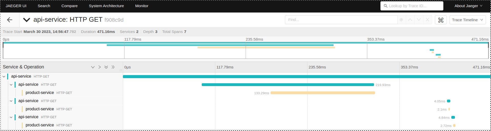

# OpenTelemetry Demo Application with Spring Boot

This is a demo application that shows how to integrate OpenTelemetry in a Spring Boot application.
The application consists of two services: api and product. The api service calls the product service several times requesting some products to return.
The application uses Jaeger to visualize the traces.

## Prerequisites

- Java 17
- Maven
- Docker
- Docker Compose

## Building the Application

The project uses two maven modules. To build the application, run the following command in the root directory of the project:

```bash
mvn clean package
```

This will build the application and generate two JAR files in their respective target folders (api-service/target and product-service/target).

# Building the Docker Image
To build the Docker image, run the following command in the root directory of the project:

```bash
docker build -t oteldemo/api-service api-service
docker build -t oteldemo/product-service product-service
```

This will build the Docker images for both components.

# Running the Application with Docker Compose
To run the application with Docker Compose, run the following command in the root directory of the project:

```bash
docker-compose up
```

This will start four containers: both applications, Jaeger and the open-telemetry-collector.

# Accessing the Application

The application can be accessed at http://localhost:8080. Try calling:

```
curl http://localhost:8080/products
```

The response should be: 

```json
[{"name":"milk","category":"beverages"},{"name":"fruit","category":"food"},{"name":"bread","category":"food"}]
```

# Accessing Jaeger
Jaeger can be accessed at http://localhost:16686.

# Viewing Traces in Jaeger
To view traces in Jaeger, follow these steps:

1. Open Jaeger at http://localhost:16686.
2. Click on the service product-service.
3. Click on the Find Traces button.
4. Click on a trace to view its details.

You should see something like this:

